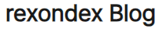

# rexondex

> all things change • nothing is lost

Developer exploring AI integration, privacy-focused architecture, and no-storage systems.

## Currently Building

**SokSol** - AI chat companion using Google Gemini API. Experimenting with zero-retention design, rate limiting, and cache-control headers.

## Focus Areas

- AI Integration: Google Gemini API, real-time chat
- Security: Privacy-first design, no user data retention
- Platforms: Web, Android
- Architecture: API security, documentation

## Writing

- [Development Log](https://rexondex.tistory.com)
- [Archive](https://rexondex.github.io/)
